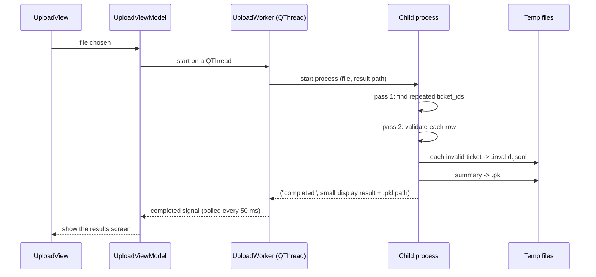

# Architecture

CSV Extractor is a PySide6 desktop app. The window stays responsive because the heavy work (reading, validating, summarizing, exporting) runs in a separate process, and the screen only ever receives the small part of the result it can display.

## Layers

```
src/
  main.py               starts logging and the window
  config.py             limits (max rows, rows shown on screen)
  logging_config.py     log file and levels
  records.py            the shapes of the data passed between layers (TypedDicts)
  processing/           pure logic, no Qt: read, validate, aggregate
    rules.py              the validation rules, defined once
    csv_reader.py         line-at-a-time reader (one record per line)
    duplicates.py         pass 1: which ticket_ids appear more than once
    validation.py         per-field validators; marks duplicate rows invalid
    aggregation.py        summary counters for valid rows
    invalid_tickets.py    writing/reading invalid tickets as JSON Lines
    processor.py          process_csv(): ties the above together
  services/             file-level jobs
    results_export_service.py   writes the report CSV
    demo_file_service.py        copies the demo file
  workers/              background processes and the Qt objects that watch them
    upload_worker.py      processing process + UploadWorker
    export_worker.py      export process + ExportWorker
    process_utils.py      poll, stop and clean up processes and files
  ui/                   widgets
    main_window.py        switches between the two views; handles closing
    upload_view.py        file choice and format hints
    results_view.py       totals, tables, export button
    processing_overlay.py spinner shown while a process runs
    view_models/          own the worker threads; views talk only to these
```

The rule that keeps this manageable: `processing` knows nothing about Qt or processes, `services` and `workers` know nothing about widgets, and views never start work themselves.

## What happens when a file is uploaded



- **Pass 1** (`duplicates.py`) builds a set of the valid ticket IDs seen so far and a count for the ones seen twice. A row cannot be called a duplicate until the whole file has been read.
- **Pass 2** (`processor.py`) validates row by row. A row whose ticket ID is in the duplicate list is marked invalid, so both rows of a pair are reported.
- **Valid rows** are added to running totals and then forgotten. **Invalid tickets** are written to disk and then forgotten. Only the counts, the per-customer hours and the set of valid ticket IDs stay in memory.
- The **display result** holds the exact totals, the summary tables, the first 100 customers and the first 100 issues.

## Exporting

`ResultsViewModel` starts an `ExportWorker`, which starts a second process. That process loads the summary from the `.pkl`, then `ResultsExportService` writes the report and reads the `.invalid.jsonl` one ticket at a time. Neither file is read whole into memory.

## Temporary files

Both are created in the system temp folder with a random name, so two runs never collide.

| File | Written by | Contents | Deleted |
| --- | --- | --- | --- |
| `csv_extractor_result_<id>.pkl` | processing process | the summary and counts (pickle) | when you go back to the upload screen, when processing fails or is stopped, or when the window closes |
| `csv_extractor_result_<id>.invalid.jsonl` | processing process | one invalid ticket per line: ID and its errors | with the `.pkl` |

`process_utils.remove_result_files()` deletes both together. A file that a stopped process was still writing is deleted too, so a half-written result can never be mistaken for a complete one.

## Failure handling

- A wrong header, empty file, missing file or non-UTF-8 file fails with a plain message on the upload screen and leaves no temp file behind.
- A malformed line (unbalanced quote, wrong number of fields) becomes an issue in the report; it does not stop the run.
- If the child process dies without answering (crash, out of memory), the worker notices and reports that processing stopped unexpectedly instead of waiting forever.
- Closing the window stops any running process without a prompt and deletes its partial output.

## Data shapes

`src/records.py` defines the dictionaries passed between layers (`RawRow`, `TicketRecord`, `ProcessingResult`, `DisplayResult` and so on) as `TypedDict`s. They are ordinary dicts at run time, and `mypy` checks the keys and types in CI.
